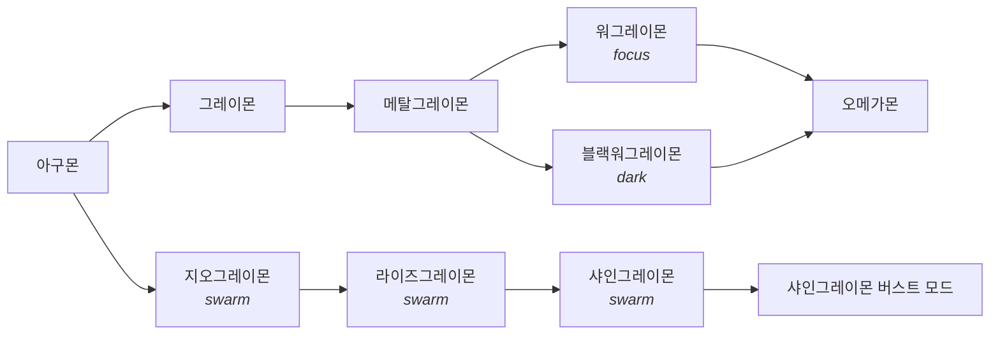
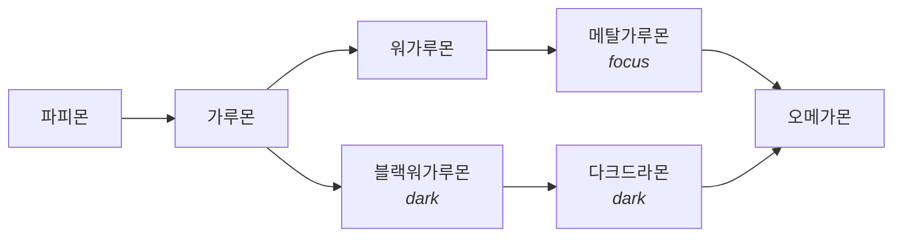
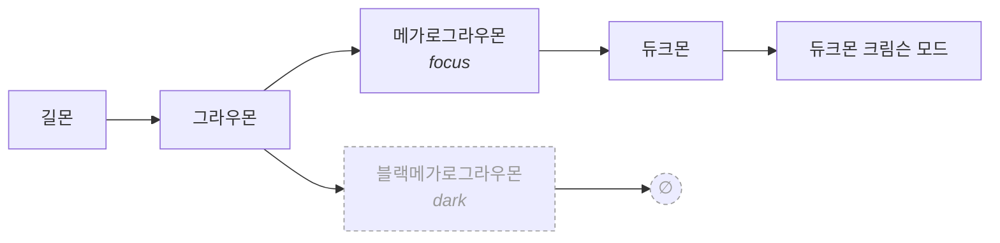
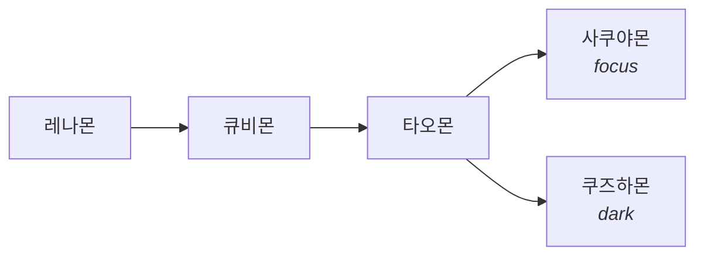
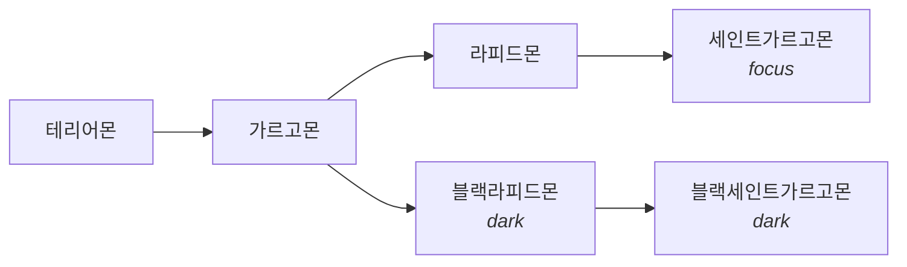
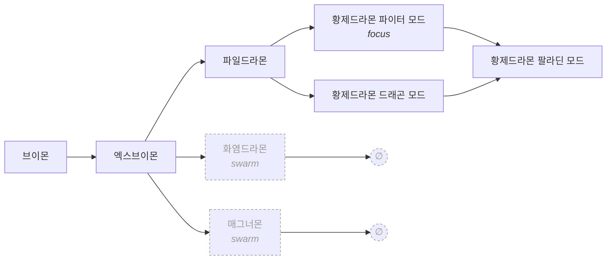

# 진화 루트(랜덤 진화) 요구사항

2026-07-31 갱신. `lib/daily.js`의 `pruneTree`/`selectRoute`와 `sprites/packs/*/pack.json`의
`tree`가 대상이다. 구현된 부분과 아직 아닌 부분을 분리해 적었다.

## 1. 왜 고쳤는가

첫 구현(커밋 `2e52e20`)은 단계별로 후보를 뽑고, 후속이 없는 분기를 만나면 **다음 단계의
spine으로 되돌아왔다**(spine 복귀). 이게 그래프에 없는 엣지를 코드가 만들어내는 짓이었다:

- `라이즈그레이몬 → 워그레이몬` — 실제 후속은 샤인그레이몬이고, 워그레이몬은 메탈그레이몬
  계보다. 서로 다른 두 계보를 이어붙였다.
- `블랙메가로그라우몬 → 듀크몬`, `매그너몬 → 황제드라몬 파이터 모드` — 같은 방식의 가짜 엣지.

결과적으로 "성숙기에서 갈라지면 이후 진화체도 제약된다"는 디지몬 진화의 기본 성질이 깨졌다.
표기상 14개였던 하루 루트 중 5개가 이렇게 만들어진 것이었다.

별개로, 게임 표에는 있지만 계보 감각과 어긋나는 엣지도 있다:

- `워가루몬 → 다크드라몬` (DWDS 표에 존재). 통상은 **블랙워가루몬 → 다크드라몬**이다.
  → D4로 재배치 완료.
- `인퍼몬 → 베르제브몬` (DWDS 표에 존재). 캐논상 베르제브몬은 임프몬 계보다. → D6으로 제거.

## 2. 설계 원칙

- **인접리스트가 유일한 진실.** 노드의 `next`에 없는 전이는 존재하지 않는다. 폴백으로
  전이를 합성하지 않는다.
- **크기에 맞는 도구.** 전체 그래프는 노드 수십 개 규모다. graph DB·전용 엔진은 과잉이며,
  `pack.json`의 인접리스트 + 20줄 DAG 워크로 충분하다.
- **부분 완성이 정상 상태.** 트리는 매주 조금씩 채워진다. 반쯤 만든 분기가 그날의 추첨을
  깨뜨리지 않아야 한다.
- **없는 데이터를 그럴듯하게 만들지 않는다.** 도트가 없으면 그 분기는 쓰지 않는다. 지표가
  일 단위가 아니면 그렇다고 적는다.
- **미완성과 짧은 완성은 다르다.** 도트를 기다리는 라인과 캐논상 거기서 끝나는 라인을
  코드가 구분해야 한다. 이 구분이 없어서 §9의 Q2가 막혀 있었다 → D7.

## 3. 데이터 모델 (`pack.json`)

```jsonc
{
  "name": "레나몬",
  "topStage": "ultimate",     // 선택. 이 라인의 천장. 생략하면 트리 최상위를 요구
  "stageNames": { ... },      // 트리 없는 팩의 고정 진화선 (호환 경로)
  "tree": {
    "<stageId>": [
      {
        "id": "greymon",          // 팩 안에서 유일
        "name": "그레이몬",        // 표시 이름 (한글명 규칙은 §7)
        "sprite": "adult",        // 도트 파일 prefix: <sprite>-0.png, -1.png ...
        "next": ["metalgreymon"], // 같은 팩의 노드 id, 반드시 **다음** 스테이지
        "traits": ["focus"]       // 선택. §5의 trait 편향에 쓰임
      }
    ]
  }
}
```

- 각 스테이지 배열의 **첫 노드가 spine**이다. 트리가 없는 팩은 `stageNames`로 동작한다(호환).
- `sprite`가 spine이면 관례적으로 스테이지 id와 같다(`adult-0.png`). 분기는
  `adult-geogreymon-0.png`처럼 `<stage>-<id>` 규칙을 쓴다.
- 도트 파일은 커밋되지 않는다. 따라서 **트리에 이름이 있어도 도트가 없을 수 있다**는 것이
  정상이며, 선택 로직이 이를 걸러야 한다(R2).
- `topStage`는 **의도적으로 짧은 라인**만 선언한다. 도트를 기다리는 중인 라인은 선언하지
  않는다 — 선언하지 않으면 트리 최상위를 요구받아, 완성될 때까지 로테이션에서 빠진다(D7).

## 4. 선택 로직 요구사항

| ID | 요구사항 | 상태 |
|---|---|---|
| R1 | 전이는 `next`에 있는 것만. spine 복귀 등 합성 엣지 금지 | ✅ 제거 완료 |
| R2 | 후보 조건 = **천장까지 엣지가 이어짐** AND **경로상 모든 노드의 `sprite` 도트가 존재** | ✅ `pruneTree` |
| R3 | 하루 고정: `hashString(dateKST\|팩\|스테이지)` 기반, 같은 날 재실행 시 동일. `daily.json`에 오늘 루트가 있으면 재사용 | ✅ 구현됨 |
| R4 | 지표 편향: 그날 활성 trait과 겹치는 후보가 있으면 그 안에서만 추첨, 없으면 전체 후보 | ✅ 구현됨 |
| R5 | 어제와 동일한 루트면 마지막 분기 스테이지를 한 칸 민다 | ✅ 구현됨 |
| R6 | 루트는 항상 천장에 도달한다 (R2의 귀결) | ✅ 가짜 엣지 없이 달성 |
| R7 | 후보가 없으면(도트 미비 등) 트리를 무시하고 `stageNames` 경로로 폴백 | ✅ `readTree`→null |
| R8 | `Math.random` 사용 금지(멱등성) | ✅ 구현됨 |

R2는 팩 로드 시점(`readTree`)에 한 번 계산하고, `selectRoute`에는 **이미 pruning된 트리**만
넘긴다. 그래서 워크는 fs를 모르는 순수 함수로 남고, 테스트는 트리를 손으로 지어 넣는다.

`pruneTree`는 2-pass다. 한 방향만으로는 부족하다:

- **backward** — 노드가 살아남는 조건 = 자기 도트 존재 AND (천장이거나, 살아남은 후속이
  하나 이상). 막다른 분기가 여기서 빠진다.
- **forward** — 살아남은 엣지만으로 알에서 도달 가능해야 한다. 엣지를 하나 지우면 멀쩡한
  노드가 고아가 되는데, 고아는 뽑히지도 않으면서 스테이지 배열의 첫 자리를 차지해 spine을
  가로챈다(D6이 정확히 이 모양을 남긴다).

어느 한 스테이지가 비면 `null`을 반환한다 = 오늘 걸을 수 있는 루트가 없음 → R7 폴백.

## 5. 성장 배경(trait) — 현재값과 한계

| trait | 조건 | 데이터 출처 | 한계 |
|---|---|---|---|
| `dark` | 도구 호출 실패율 ≥ 5% | `global.json` 누적 카운터 | **일 단위가 아님.** 일일 실패 카운터를 `hook.js`에 추가해야 해결 (Q4) |
| `swarm` | 그날 토큰을 쓴 세션 ≥ 5 | `daily.json` `sessionTokens` | 일 단위 ✅. 지오그레이몬 라인 개통 전까지는 **가를 분기가 0개**였다(D11) |
| `focus` | 한 세션이 그날 output의 60% 이상 | 동일 | 일 단위 ✅ |

## 6. 점진적 채우기 (주 ~15노드)

R2가 있으면 다음 순서로 아무 때나 노드를 추가할 수 있다.

1. DWDS 시트를 `sprites/sheets/dwds/<name>.png`로 넣는다.
2. `--rows <name>`으로 **정면 행**을 찾는다(눈이 보이는 행). 단일 행 시트면 생략 가능.
3. 그 행에서 프레임 2개를 고른다 — 원형 도트가 있으면 IoU로, 없으면 눈으로.
4. `PICKS`에 한 줄(`"<stage>-<id>": ("<sheet>", [i, j], row)`), `pack.json` `tree`에 노드 하나.
5. 추출 → `node --test test/daily.test.js` → `node scripts/tree-status.js --verbose`.

노드당 1~2분이며 병목은 프레임 고르기다. **천장까지의 사슬을 완성시키는 노드를 우선**한다
(한 노드가 루트 하나를 즉시 늘린다). 사슬 중간 노드만 늘리면 R2 때문에 아직 추첨에 들어오지
않는다 — 의도된 동작이고, `tree-status.js --verbose`가 그 이유를 노드별로 찍어준다.

### 시트 출처가 둘이고, 레이아웃이 다르다 (2026-07-31)

지금 `sprites/sheets/dwds/`에 든 51개는 출처가 두 곳이며 **필드 스프라이트 배치가 다르다.**
`field_frames`는 전자를 전제로 만들어졌으므로 후자에서는 프레임 고르기가 훨씬 어렵다.

| 출처 | 필드 스프라이트 배치 | `field_frames` | 비고 |
|---|---|---|---|
| spriters-resource (기존 45개, "compiled by RADSPYRO") | **하단 단일 행** 8~9프레임, 컬러 패널 배경 | 그 행을 그대로 찾는다 | `PICKS`의 `[6,7]`·`[3,4]` 같은 인덱스가 이 배치 기준 |
| withthewill (신규 6개, "By Zero_xm7") | **방향별 행 격자**(보통 3행, 많으면 8행), 투명 배경 | 밴드 하나만 잡는데 그게 정면 행이 아니다 | 블랙워가루몬에서 **후면 행**을 골랐다 |

이게 "시트가 있는데 못 쓴다"의 정체였다. 밴드 탐색은 점수가 가장 높은 한 행만 남기고,
격자 시트에서 그 한 행은 하필 뒤통수 행이기도 하다. 아래에서 어떤 행도 지목할 수 없었으므로
시트 자체가 사용 불가였다.

해결은 `field_rows()` + `PICKS`의 **세 번째 요소(행 번호)**다. 행은 y축 겹침으로 묶는다 —
한 행의 스프라이트는 baseline을 공유하고 두 행은 수직으로 겹치지 않는다. 행 번호는
**시트마다 다르다**(블랙메가가르고몬은 8행 중 row6이 정면). 절대 가정하지 말고 `--rows`로 본다.

spriters-resource는 **이 환경에서 Cloudflare 403**이라 자동 수집이 불가하다(루트부터 막힌다).
브라우저로는 열리므로, 기존 배치의 시트가 필요하면 사람이 받아야 한다.
withthewill 쪽은 `sprite_thread.zip`(541개, 15MB) 하나에 DWDS 로스터가 전부 들어 있다.

프레임 판별에 쓸 수 있는 것과 못 쓰는 것을 실측했다:

- **행 고르기 — `--rows` 육안.** 행을 **쌓아 놓고** 보면 방향이 읽힌다. 정면 행은 모든
  스프라이트에 **눈이 보이는** 행이다(블랙라피드몬 금색, 세이버레오몬 청록, 쿠즈하몬
  주황 얼굴 표식). 프레임을 하나씩 볼 때는 불가능하던 판별이 행 단위로는 쉽다.
- **프레임 고르기 — 원형 도트와의 실루엣 IoU.** 정면 행 안에서, 이미 배포된 원형의 두
  프레임 각각에 가장 가까운 인덱스를 쌍으로 쓴다. 순수 색변경이면 1.000으로 맞는다
  (블랙세인트가르고몬). 프레임 순서는 시트마다 섞여 있어 인덱스를 옮겨 쓸 수는 없다.
- **못 씀 — 프레임 단위 육안 판별.** 28~32px에 어두운 팔레트면 정면/후면/측면이 구분되지
  않는다. 실제로 육안으로 고른 쌍이 IoU 측정에서 반증됐다(블랙워가루몬).
- **못 씀 — 좌우 대칭도.** 검증된 정면 도트의 대칭도가 0.270~0.816으로 흩어져 있어
  판별 기준이 되지 않는다(걷기 자세·무기·날개가 대칭을 깬다).

원형 도트가 없는 종(세이버레오몬 등)은 IoU 단계를 쓸 수 없다. 그때는 정면 행을 확정한 뒤
그 행에서 가장 정면다운 두 프레임을 눈으로 고른다 — 행이 정해진 뒤라 실패 여지가 작다.

### 필요한 도구

| 도구 | 목적 | 상태 |
|---|---|---|
| `--contact <sheet>` | 감지된 **한 행**의 프레임을 번호 붙여 한 줄로 렌더 | ✅ 있음 |
| `--rows <sheet>` | **모든** 방향 행을 쌓아 확대 렌더. 정면 행을 고르는 수단 | ✅ 있음 |
| `PICKS` 세 번째 요소 | 어느 행을 인덱싱할지 지정 (`("sheet", [i,j], row)`) | ✅ 있음 |
| 트리 lint 테스트 | `next` id 존재, 다음 스테이지만 가리킴(→순환 불가), 중복 id, spine 존재, 천장 초과 금지 | ✅ `test/daily.test.js` |
| `scripts/tree-status.js` | 팩별 로테이션 여부·천장·루트 수, `--verbose`로 추첨 제외 노드와 사유 | ✅ 있음 |
| `scripts/evolution-map.js` | §12 mermaid 맵 생성. `--write` 갱신, `--check` 낡음 검사(테스트가 호출) | ✅ 있음 |

## 7. 이름 규칙

한글명은 [Wikimon](https://wikimon.net)의 「Korean (한국어)」 표기를 따른다. 직역과 다른
사례가 실제로 여럿 있었다: GeoGreymon = 지오그레이몬, Peckmon = 펙크몬, Varodurumon =
발두르몬, Armagemon = 아마게몬, Flamedramon = 화염드라몬, Magnamon = 매그너몬,
Imperialdramon = 황제드라몬. 한국 위키 사이트(나무위키·우만위키)는 봇 차단이라 자동 조회
경로로 쓸 수 없다.

## 8. 결정 기록

| # | 결정 | 근거 |
|---|---|---|
| D1 | spine 복귀 제거, R2(도달 가능성 + 도트 존재) 도입 | 가짜 엣지가 계보 제약을 깼다 |
| D2 | 천장 미달 루트는 추첨하지 않는다(B안) | 2M 도달일에 천장을 못 보는 일이 없어야 한다 |
| D3 | 지연 진화(단계 도달 시점에 다음 노드 결정, A안)는 보류 | D2와 상충. `dark`를 일 단위로 만들면 이점 일부를 따로 얻을 수 있다 |
| D4 | `다크드라몬`은 `가루몬 → 블랙워가루몬 → 다크드라몬`으로 재배치 | 게임 표의 `워가루몬 → 다크드라몬`이 계보 감각과 어긋난다. 시트 존재(`BlackWereGarurumon` 48678). **적용 완료 (2026-07-31)** |
| D5 | 쓰지 않는 분기 도트는 지우지 않는다 | gitignore 대상이고, 상위 노드가 채워지면 즉시 되살아난다 |
| D6 | `인퍼몬 → 베르제브몬` 제거 (Q1 해결) | 유지하려면 `베르제브몬 → 아마게몬`이라는 **두 번째** 가짜 엣지가 필요하다(아마게몬은 디아블로몬 계보). 원칙 1 위반이 하나가 아니라 둘이었다. 케라몬 루트 2→1. 도트는 D5에 따라 남긴다 |
| D7 | `pack.json`에 `topStage` 명시 선언 도입 (Q2 해결) | 벤치된 3팩이 서로 다른 이유로 벤치돼 있었다. 임프몬은 캐논 초궁극체(베르제브몬 블래스트 모드)가 있는데 **도트가 없는 미완성**, 레나몬(사쿠야몬)·테리어몬(세인트가르고몬)은 **캐논상 초궁극체가 없는 짧은 완성**이다. 전자는 계속 제외(D2 유지), 후자는 천장을 선언해 복귀. 로테이션 6→8팩 |
| D8 | 블랙워그레이몬 뒷모습 도트 유지 (Q3 보류) | 9개 루트 중 `dark` 편향일 때만 나온다. 추출기에 행 선택 옵션이 필요한 별건이고 진화 로직과 무관 |
| D9 | `field_rows()` 도입, `PICKS`에 행 번호 (Q7 해결) | 밴드 탐색이 격자 시트에서 후면 행을 고르고 있었고, 아래 계층에서 다른 행을 지목할 방법이 없었다. 행은 y축 겹침으로 묶는다. **D8/Q3도 이 수단으로 해결 가능해졌다** — 블랙워그레이몬에 행 번호를 주면 된다 |
| D11 | 지오그레이몬 라인을 `샤인그레이몬 → 샤인그레이몬 버스트 모드`로 천장까지 연결 | 문서가 `샤인그레이몬 ❌ DS 립 없음`으로 적어 둔 게 틀렸다. 근거였던 README 조사는 **초궁극체 등급**만 훑은 것이고 샤인그레이몬은 궁극체다. 실제로 withthewill zip에 본체(`374`)와 버스트 모드(`385`) 둘 다 있었다. 이걸로 `swarm` trait이 처음으로 실제 분기를 갖는다 — 그전까지 swarm 노드 5개 중 4개가 R2 제외였고, 남은 하나(디아블로몬)는 그 단계의 유일 후보여서 게이트가 무의미했다 |
| D10 | 테리어몬의 블랙 라인을 `가르고몬 → 블랙라피드몬 → 블랙세인트가르고몬`으로 배치 | 아구몬(블랙워그레이몬)·길몬(블랙메가로그라우몬)이 이미 흑화체를 같은 단계의 형제 분기로 두는 선례다. 두 흑화체가 서로 이어지는 편이 계보 감각에 맞고, 세이버레오몬처럼 근거 없는 엣지를 만들지 않는다 |

## 9. 열린 질문

Q1(인퍼몬→베르제브몬)·Q2(백로그 도달 불가)·Q3(블랙워그레이몬 도트)는 각각 D6·D7·D8로 닫혔다.

- **Q4.** `dark`를 일 단위로 만들려면 `hook.js`에 일일 실패 카운터가 필요하다(§5). 이게
  없으면 `dark` 분기(블랙워가루몬·다크드라몬 계열)가 누적 실패율에 묶여 거의 고정된다.
- **Q5 (절반 해결).** `베르제브몬 블래스트 모드` **시트는 존재한다** —
  withthewill `sprite_thread.zip`의 `392_BeelzebumonBlast.png`를
  `sprites/sheets/dwds/beelzemon_bm.png`로 넣어 뒀다. 따라서 (b)안(임프몬에 천장 선언)은
  불필요하고 D7의 구분도 지킬 수 있다. 남은 것은 프레임 고르기이며, 이 시트는 §6의
  까다로운 배치 쪽이다. 도트가 들어오면 임프몬이 로테이션에 복귀하고 백로그 7노드가 함께
  풀린다.
- **Q7 해결.** `field_rows()` + `PICKS` 행 지정으로 격자 배치 시트를 쓸 수 있게 됐다.
  세이버레오몬만 배치 미정으로 남았다(아래 Q8).
- **Q8.** 세이버레오몬 시트는 확보했고 정면 행(row1)도 확인했지만, **테리어몬 계보에 붙일
  근거가 없다** — 캐논상 레오몬 계보다. DWDS 진화표를 확인해 붙일 자리를 정하거나, 다른
  팩(신규 라인)으로 돌릴지 결정해야 한다. 근거 없이 엣지를 만들지 않는다(원칙 1).

## 10. 백로그 (DWDS 시트 보유 = 즉시 작업 가능)

D7 이후 레나몬·테리어몬의 천장이 `ultimate`이므로, 두 팩의 백로그는 더 이상 초궁극체를
기다리지 않는다 — 넣는 즉시 루트가 늘어난다. 두 팩은 아직 `tree` 자체가 없어서 `stageNames`
고정선으로 렌더되므로, 첫 분기를 넣을 때 트리도 함께 만든다.

"시트" 열은 **로컬 `sprites/sheets/dwds/`에 파일이 있는지**를 뜻한다. 이전 판의
`✅ 48570` 같은 표기는 spriters-resource의 asset ID였을 뿐 파일 보유를 뜻하지 않았다.
아래 ✅는 2026-07-31에 withthewill `sprite_thread.zip`에서 받아 넣은 것이다. 전부 §6의
격자 배치이며, D9의 행 지정으로 프레임까지 확정해 **도트 추출을 마쳤다**.

| 팩 | 추가 노드 | 시트 | 루트 증가 |
|---|---|---|---|
| 테리어몬 | 블랙라피드몬, 블랙세인트가르고몬 | ✅ **완료 (D10)** | **+1 (트리 신설로 2루트)** |
| 레나몬 | 쿠즈하몬 | ✅ **완료** | **+1 (트리 신설로 2루트)** |
| 파피몬 | 블랙워가루몬 (D4) | ✅ **완료** | +0 (기존 다크드라몬 루트를 정상화) |
| 임프몬 | 베르제브몬 블래스트 모드 (Q5) | ✅ **완료** | 로테이션 복귀 |
| 임프몬 | 로치몬, 바이럴몬, 메가쿠와가몬 블루, 미미몬, 크리피몬, 구울몬 | ❌ withthewill에 없음 (소서리몬만 있음) | Q5 도트 후 +3 |
| 테리어몬 | 프레리몬 | ❌ withthewill 541개에 없음 | — |
| (미정) | 세이버레오몬 | ✅ 보유, 정면 행 확인 | 붙일 자리 미정 (Q8) |
| 길몬 | 카오스듀크몬 | ❌ 미보유 | +0 (듀크몬 크림슨 모드로 이어지지 않아 R2가 제외) |
| 아구몬 | 샤인그레이몬 + 버스트 모드 | ✅ **완료** | **+1 (지오그레이몬 라인 개통)** |

## 11. 현재 상태 (2026-07-31)

`node scripts/tree-status.js` 실측:

| 팩 | 로테이션 | 천장 | 루트 |
|---|---|---|---|
| 아구몬 | ✅ | superultimate | 2 |
| 파피몬 | ✅ | superultimate | 2 (D4로 다크드라몬이 블랙워가루몬 아래로) |
| 브이몬 | ✅ | superultimate | 2 |
| 길몬 | ✅ | superultimate | 1 |
| 케라몬 | ✅ | superultimate | 1 |
| 팔코몬 | ✅ | superultimate | 1 |
| 레나몬 | ✅ | ultimate | 2 (사쿠야몬 / 쿠즈하몬) |
| 테리어몬 | ✅ | ultimate | 2 (세인트가르고몬 / 블랙세인트가르고몬) |
| 임프몬 | ✅ | superultimate | — (stageNames 고정선) |

- **로테이션 9팩 / 유효 9팩, 하루 루트 13개.** 이번 작업 전은 8팩·9루트였고, 그 전(R1/R2
  적용 전)은 표기상 14루트 중 5개가 spine 복귀로 만들어진 가짜였다.
- 임프몬이 베르제브몬 블래스트 모드 도트를 얻어 로테이션에 복귀했다(Q5). 아직 트리가 없어
  `stageNames` 고정선으로 렌더된다 — 백로그 6노드는 시트가 없다(§10).
- R2로 빠진 노드: 지오그레이몬·라이즈그레이몬(샤인그레이몬 없음), 블랙메가로그라우몬,
  화염드라몬·매그너몬(아머체는 후속 없음). 전부 도트는 남아 있고(D5) 상위 노드가 채워지면
  즉시 복귀한다.
- 레나몬 `adult` 이름을 `미호몬` → `큐비몬`으로 고쳤다. 도트는 `kyubimon` 시트에서 뽑고
  있었으므로 이름만 다른 종을 가리키고 있었다(§7).
- 천장이 낮은 팩에 트리가 생기면 `route`에 `superultimate` 키가 없다. `applyRoute`는
  스테이지별로 폴백하므로(`activeRouteNames[stageId]` → `stageNames`, 스프라이트는
  `sprites[$0] ?? $0`) 짧은 route를 그대로 견딘다 — 레나몬·테리어몬 트리를 넣을 때 Swift
  변경이 필요 없었고, 실제로 없었다.
- 검증: `node --test test/daily.test.js` → **49 pass / 0 fail**.
- 메뉴바 재빌드 필요: `cd menubar && swiftc -O -o claudemon-menubar
  claudemon-menubar.swift` → `launchctl kickstart -k gui/$(id -u)/com.muo.claudemon-menubar`.

## 12. 진화 노드 맵 (생성물)

`node scripts/evolution-map.js --write`로 갱신한다. 손으로 고치지 않는다 — `pack.json`이
유일한 출처이고, `--check`가 낡음을 테스트 실패로 잡는다(§6 도구 표).

<!-- BEGIN evolution-map (generated by scripts/evolution-map.js -- do not edit by hand) -->

알(`digitama`)과 유년기(`baby`)는 어느 팩에서도 분기가 없어 생략했다. 성장기부터 팩의
천장까지 그린다. 점선/회색은 R2가 추첨에서 제외한 노드이며, `∅`는 후속이 없어 천장까지
이어지지 않는 막다른 분기다 — 예전에 spine 복귀가 가짜 엣지를 만들던 자리다.
기울임체는 그 분기를 끌어당기는 `trait`(§5)이다.

최상위 스테이지는 `superultimate`, 로테이션 9팩 / 유효 9팩.

**아구몬** (`agumon`) — 천장 `superultimate`



**팔코몬** (`falcomon`) — 천장 `superultimate`


**파피몬** (`gabumon`) — 천장 `superultimate`



**길몬** (`guilmon`) — 천장 `superultimate`



**임프몬** (`impmon`) — 천장 `superultimate` · 트리 없음(`stageNames` 고정선)

```
임프몬 → 데블몬 → 뱀파이몬 → 베르제브몬 → 베르제브몬 블래스트 모드
```

**케라몬** (`keramon`) — 천장 `superultimate`


**레나몬** (`renamon`) — 천장 `ultimate`



**테리어몬** (`terriermon`) — 천장 `ultimate`



**브이몬** (`veemon`) — 천장 `superultimate`



<!-- END evolution-map -->
